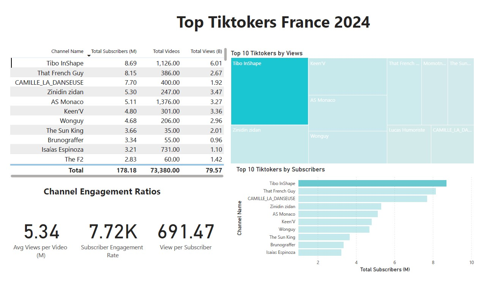

# TikTok Marketing Campaign Analysis (France · 2024)

> **Live portfolio:** https://dos-analysis.github.io/TikTok-Marketing-Campaign-Analysis/  
> **Repository:** https://github.com/Dos-Analysis/TikTok-Marketing-Campaign-Analysis

---

## Table of contents
- [Overview](#overview)
- [Objective](#objective)
- [Data & Tools](#data--tools)
- [Process](#process)
- [Dashboard](#dashboard)
- [Answers to the 6 questions](#answers-to-the-6-questions)
- [Recommendations (plain English)](#recommendations-plain-english)
- [Simple ROI checks (€)](#simple-roi-checks-€)
- [Why this project matters](#why-this-project-matters)
- [Links](#links)

---

## Overview
I analyzed public TikTok channel data for **France (2024)** to help a marketing team pick the **right creators** for paid collaborations.  
The result is an **interactive Power BI dashboard** plus **clear recommendations** with simple ROI estimates in **euros (€)**.

## Objective
Pick creators based on what actually moves the needle:
- **Subscribers**
- **Total views**
- **Videos published**
- **Engagement indicators** (views per subscriber, engagement per video)

## Data & Tools
- **Data:** Kaggle extract of top French TikTok channels (2024)
- **Excel:** quick exploration  
- **SQL Server:** cleaning, shaping, validation  
- **Power BI:** interactive visuals + DAX  
- **GitHub Pages:** documentation & hosting

## Process
1) Explore the data → keep the columns I need (channel name, subscribers, views, videos).  
2) Clean & validate (types, row/column counts, duplicates).  
3) Build visuals that answer 6 business questions.  
4) Translate metrics into **decisions** and **€ ROI** scenarios.

## Dashboard
Screenshot (with **Tibo Inshape** selected — ranked #1 by subscribers in this dataset):

Short GIF showing interactivity:

---

## Answers to the 6 questions

### 1) Top 10 creators by **subscribers**
| Name | Subscribers | Avg views/video |
|:--|--:|--:|
| Tibo InShape @tiboinshape | 8 688 608 | 5.34M |
| That French Guy @davidyrodriguez | 8 145 455 | 6.92M |
| CAMILLE_LA_DANSEUSE @camille_la_danseuse | 7 698 611 | 4.80M |
| Zinidin zidan @zidanofficial_ | 5 304 348 | 14.06M |
| AS Monaco @asmonaco | 5 108 696 | 2.37M |
| Keen’V @keenvsurtiktok | 4 800 000 | 11.17M |
| Wonguy @wonguy | 4 683 824 | 14.35M |
| The Sun King @carlomalis | 3 661 429 | 57.44M |
| Brunograffer @brunograffer | 3 335 294 | 17.47M |
| Isaías Espinoza @chefenproceso | 3 209 434 | 1.50M |

**Takeaway:** *Tibo Inshape* leads by subscribers; **That French Guy** often brings more **per-post views**, which helps ROI.

---

### 2) Top 3 by **number of videos**
| Name | Videos | Avg views/video |
|:--|--:|--:|
| Learn French with Pierre! @francaisavecpierre | 24 039 | 20 550 |
| H-ley Irène🧿 @hleyirene228 | 8 628 | 93 085 |
| Thomas Rossier @thomasrossier | 5 625 | 120 916 |

**Takeaway:** Volume ≠ impact. Check views per video before funding a series.

---

### 3) Top 3 by **total views**
| Name | Total views | Avg views/video |
|:--|--:|--:|
| Tibo InShape @tiboinshape | 6.01B | 5.34M |
| Zinidin zidan @zidanofficial_ | 3.47B | 14.06M |
| Keen’V @keenvsurtiktok | 3.36B | 11.17M |

**Takeaway:** Huge total reach → ideal for broad awareness.

---

### 4) Top 3 by **average views per video**
| Name | Avg views/video | Subscribers |
|:--|--:|--:|
| Oh My Goal – France @ohmygoalfrance | 312.89M | 997 444 |
| AnnaLaura Pavy @lalpavy | 59.50M | 1 538 710 |
| The Sun King @carlomalis | 57.44M | 3 661 429 |

**Takeaway:** Excellent **impact per post**.

---

### 5) Top 3 by **views per subscriber**
| Name | Views / subscriber | Subscribers |
|:--|--:|--:|
| Minajlabomb @minajlabomb | 1 185.79 | 1 109 792 |
| Elie @eliefy | 1 061.04 | 1 008 315 |
| Céline @celineinno | 1 031.97 | 1 680 000 |

**Takeaway:** Content breaks out beyond the base regularly.

---

### 6) Top 3 by **engagement per video**
| Name | Engagement / video | Subscribers | Videos |
|:--|--:|--:|--:|
| Oh My Goal – France @ohmygoalfrance | 332 481 | 997 444 | 3 |
| AnnaLaura Pavy @lalpavy | 109 908 | 1 538 710 | 14 |
| The Sun King @carlomalis | 104 612 | 3 661 429 | 35 |

**Takeaway:** Great when you plan **fewer, higher-impact** placements.

---

## Recommendations (plain English)
- For **maximum per-post impact**: start with **Zinidin zidan** or **The Sun King**; also consider **Oh My Goal – France** for premium launches.  
- For **consistent reach with a large base**: **Tibo Inshape** is a safe pick; **That French Guy** often delivers **better per-post ROI**.  
- For a **10-video series**: **Thomas Rossier** performs best on expected net return; don’t fund series where average views can’t cover costs.  
- Use a **pilot → measure → scale** approach: test creatives and track sales/engagement before expanding.

---

## Simple ROI checks (€)
Assumptions used for quick comparisons: **€5 price**, **2% conversion**, **€50k** one-off video fee, or **10×€5k** for a series.

### A) Picking by subscribers (one-off video)
| Name | Avg views/video (M) | Units/video | Revenue/video | Net/video |
|:--|--:|--:|--:|--:|
| Tibo Inshape | 5.34 | 106 712 | €533 559.86 | **€483 559.86** |
| That French Guy | 6.92 | 138 310 | €691 551.63 | **€641 551.63** |
| CAMILLE_LA_DANSEUSE | 4.80 | 96 074 | €480 369.76 | **€430 369.76** |

**Best here:** **That French Guy**.

### B) Picking by most videos (series, 10×€5k)
| Name | Avg views/video | Units/video | Revenue/video | Series revenue | Series cost | Net |
|:--|--:|--:|--:|--:|--:|--:|
| Learn French with Pierre! | 20 550 | 411 | €2 055.03 | €20 550.28 | €50 000 | **€-29 449.72** |
| H-ley Irène🧿 | 93 085 | 1 862 | €9 308.49 | €93 084.89 | €50 000 | **€43 084.89** |
| Thomas Rossier | 120 916 | 2 418 | €12 091.58 | €120 915.76 | €50 000 | **€70 915.76** |

**Best series:** **Thomas Rossier**.

### C) Picking by total views (one-off video)
| Name | Avg views/video (M) | Units/video | Revenue/video | Net/video |
|:--|--:|--:|--:|--:|
| Tibo Inshape | 5.34 | 106 712 | €533 559.86 | **€483 559.86** |
| Zinidin zidan | 14.06 | 281 176 | €1 405 879.37 | **€1 355 879.37** |
| Keen’V | 11.17 | 223 362 | €1 116 811.25 | **€1 066 811.25** |

**Best here:** **Zinidin zidan**.  
*Note:* These are rough, comparable estimates (not forecasts).

---

## Why this project matters
I turned a raw dataset into **clear decisions**. The dashboard shows **who to pick and why**, and this README translates metrics into **business outcomes in €** so anyone can follow and act.

---

## Links
- **Live portfolio:** https://dos-analysis.github.io/TikTok-Marketing-Campaign-Analysis/  
- **Repository:** https://github.com/Dos-Analysis/TikTok-Marketing-Campaign-Analysis
